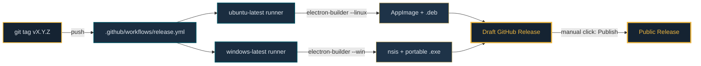

<div align="center">


# Instagram Messenger

**A polished Electron desktop wrapper for Instagram Direct — tray, notifications, global hotkey, autostart, the works.**

[](./LICENSE)
[](#install)
[](https://www.electronjs.org/)
[](https://github.com/adrenal36/instagram-messenger/releases)
[](https://github.com/adrenal36/instagram-messenger/actions)
<br>
[](https://github.com/adrenal36/instagram-messenger/releases)
[](https://github.com/adrenal36/instagram-messenger/commits/master)
[](#architecture)
[](#-installing-via-an-ai-assistant-easiest-path)

</div>

---

> [!WARNING]
> **Unofficial.** Not affiliated with, endorsed by, or related to Meta / Instagram. This is a personal convenience wrapper that loads `instagram.com/direct/inbox/` in a dedicated Electron window.

## Table of contents

- [🤖 Installing via an AI assistant (easiest path)](#-installing-via-an-ai-assistant-easiest-path)
- [Install](#install)
  - [Option A — Download prebuilt](#option-a--download-prebuilt-recommended)
  - [Option B — Automated install (AI-executable)](#option-b--automated-install-ai-executable)
  - [Option C — Build from source](#option-c--build-from-source)
- [First launch](#first-launch)
- [Features](#features)
- [Keyboard shortcuts](#keyboard-shortcuts)
- [Known limitations](#known-limitations)
- [Security and privacy](#security-and-privacy)
- [How releases are built](#how-releases-are-built-ci--cd)
- [Architecture](#architecture)
- [For AI agents reading this document](#for-ai-agents-reading-this-document)
- [License](#license)

---

## 🤖 Installing via an AI assistant (easiest path)

> [!TIP]
> **This README is designed to be handed to an AI assistant** (Claude, ChatGPT, Gemini, or any capable coding AI) which will install the app for you automatically.

Open your AI of choice and paste this prompt:

> Please install the Instagram Messenger app for me. The full structured install instructions are at `https://github.com/adrenal36/instagram-messenger/blob/master/README.md` — read the "Automated install" section and follow the commands for my operating system.

The AI will: detect your OS, check prerequisites, find the latest release via the GitHub API, download the right asset, install it, and launch the app. You'll only need to log into Instagram once when the window opens.

<details>
<summary>📋 Common questions an AI might ask (and how to answer)</summary>

- ***"What's your Linux distribution?"*** → answer with the name: Ubuntu, Debian, Fedora, Arch, Mint, etc.
- ***"Install system-wide or just for my user?"*** → the `.AppImage` is per-user (no root), the `.deb` is system-wide (needs `sudo`). Pick whichever fits.
- ***"May I run `sudo`?"*** → required only for the `.deb` path on Linux. Say yes to use `apt install`, or no to use the AppImage instead.
- ***"Which browser are you currently using Instagram in?"*** → irrelevant, this is a separate app with its own session.

</details>

Everything the AI needs is in the [structured instructions below](#option-b--automated-install-ai-executable).

---

## Install

### Option A — Download prebuilt (recommended)

Go to the [**Releases page**](https://github.com/adrenal36/instagram-messenger/releases/latest) and grab the file that matches your system:

| Your OS | File | What it is |
|---|---|---|
| 🐧 **Linux — any distro** | `Instagram Messenger-X.Y.Z.AppImage` | Single portable file. No install. `chmod +x` and run. |
| 🐧 **Debian / Ubuntu / Mint / Pop!_OS** | `instagram-messenger_X.Y.Z_amd64.deb` | System install via `sudo apt install ./file.deb`. Registers in your app menu. |
| 🪟 **Windows 10/11** | `Instagram Messenger Setup X.Y.Z.exe` | Standard installer. Double-click and follow the wizard. |
| 🪟 **Windows (portable)** | `Instagram Messenger X.Y.Z.exe` | No-install single-file. Copy anywhere and run. |
| 🍎 **macOS** | *not yet available* | See [Known limitations](#known-limitations) — PRs welcome. |

### Option B — Automated install (AI-executable)

These commands are idempotent, self-contained, and use the GitHub API to resolve the latest release so they work without hardcoding a version. Pick the section matching your OS and run it top to bottom.

<details open>
<summary><strong>🐧 Linux — Debian / Ubuntu / Pop!_OS / Linux Mint</strong> (.deb)</summary>

**Prerequisites:** `curl` (usually preinstalled), `sudo`, `apt`. Standard on any Debian-family distro.

```bash
# 1. Resolve the latest .deb asset URL via the GitHub API
ASSET_URL=$(curl -sL https://api.github.com/repos/adrenal36/instagram-messenger/releases/latest \
  | grep -oE '"browser_download_url": *"[^"]*_amd64\.deb"' \
  | head -1 \
  | sed 's/.*"\(https:[^"]*\)".*/\1/')
echo "Resolved: $ASSET_URL"

# 2. Download to /tmp
curl -L -o /tmp/instagram-messenger.deb "$ASSET_URL"

# 3. Install (apt handles any missing dependencies automatically)
sudo apt install -y /tmp/instagram-messenger.deb

# 4. Verify the binary is on PATH
which instagram-messenger && echo "Install OK"

# 5. Launch (detached from shell)
instagram-messenger >/dev/null 2>&1 &
disown
```

**Expected result:** Instagram Messenger appears in your GNOME/KDE app menu with a frosted-glass camera icon. The window opens showing Instagram's cookie consent banner, then the login screen. Accept the cookies, log in, and you're done — the session persists to `~/.config/Instagram Messenger/` for all future launches.

</details>

<details>
<summary><strong>🐧 Linux — any other distro</strong> (Arch, Fedora, openSUSE, NixOS, …) via AppImage</summary>

**Prerequisites:** `curl`, and `libfuse2` on modern distros. One-liner per family:
- Ubuntu 22.04+ / Mint: `sudo apt install -y libfuse2`
- Arch: `sudo pacman -S fuse2`
- Fedora: `sudo dnf install fuse`

```bash
# 1. Resolve the latest AppImage asset URL
ASSET_URL=$(curl -sL https://api.github.com/repos/adrenal36/instagram-messenger/releases/latest \
  | grep -oE '"browser_download_url": *"[^"]*\.AppImage"' \
  | head -1 \
  | sed 's/.*"\(https:[^"]*\)".*/\1/')
echo "Resolved: $ASSET_URL"

# 2. Download to ~/Applications (conventional location for per-user AppImages)
mkdir -p ~/Applications
curl -L -o ~/Applications/instagram-messenger.AppImage "$ASSET_URL"
chmod +x ~/Applications/instagram-messenger.AppImage

# 3. Launch
~/Applications/instagram-messenger.AppImage >/dev/null 2>&1 &
disown
```

To register it in your app menu automatically, install [`appimaged`](https://github.com/probonopd/go-appimage) or [`AppImageLauncher`](https://github.com/TheAssassin/AppImageLauncher) once. Otherwise just run it directly from `~/Applications/`.

</details>

<details>
<summary><strong>🪟 Windows 10 / 11 — installer</strong> (PowerShell)</summary>

**Prerequisites:** PowerShell 5.1+ (built into every Windows 10 and 11 — nothing to install).

Open PowerShell and run:

```powershell
# 1. Resolve the latest installer URL via the GitHub API
$assetUrl = (Invoke-RestMethod "https://api.github.com/repos/adrenal36/instagram-messenger/releases/latest").assets |
  Where-Object { $_.name -like "*Setup*.exe" } |
  Select-Object -First 1 -ExpandProperty browser_download_url
Write-Host "Resolved: $assetUrl"

# 2. Download the installer
$installer = "$env:TEMP\instagram-messenger-setup.exe"
Invoke-WebRequest -Uri $assetUrl -OutFile $installer

# 3. Run the installer (interactive)
Start-Process -FilePath $installer -Wait

# 4. Launch
Start-Process "$env:LOCALAPPDATA\Programs\instagram-messenger\Instagram Messenger.exe"
```

**For a silent (non-interactive) install**, add `-ArgumentList "/S"` to the Start-Process call on step 3:

```powershell
Start-Process -FilePath $installer -ArgumentList "/S" -Wait
```

> [!NOTE]
> **SmartScreen warning:** The build is unsigned. Windows SmartScreen will show "Windows protected your PC" the first time you run the installer. Click **More info** → **Run anyway**. Code-signing certs cost ~$100/year and aren't worth it for a personal wrapper — the app is open source, you can verify what it does before installing.

</details>

<details>
<summary><strong>🪟 Windows — portable</strong> (no install)</summary>

```powershell
$assetUrl = (Invoke-RestMethod "https://api.github.com/repos/adrenal36/instagram-messenger/releases/latest").assets |
  Where-Object { $_.name -like "*.exe" -and $_.name -notlike "*Setup*" } |
  Select-Object -First 1 -ExpandProperty browser_download_url

$portable = "$env:USERPROFILE\Desktop\Instagram Messenger.exe"
Invoke-WebRequest -Uri $assetUrl -OutFile $portable
Start-Process -FilePath $portable
```

Result: a single `.exe` on your Desktop. Double-click to run. No registry changes, no Start menu entry, no install. Deletes cleanly by dragging to the trash.

</details>

### Option C — Build from source

<details>
<summary><strong>For any OS — clone, install deps, build</strong></summary>

```bash
git clone https://github.com/adrenal36/instagram-messenger.git
cd instagram-messenger
npm install

# Run immediately in development mode (no build needed)
npm start

# Or build installable packages
npm run dist:linux    # produces AppImage + .deb in dist/
npm run dist:win      # produces Windows zip in dist/
```

**Prerequisites:** Node.js 20 or newer, `npm`, and `git`. That's it.

> [!NOTE]
> **Windows cross-compile from Linux:** `electron-builder` runs `winCodeSign` (an rcedit step for icon metadata) through Wine. Without Wine installed, the local `dist:win` build falls back to a plain `.zip`. The official GitHub Actions release pipeline builds Windows natively on a `windows-latest` runner, so downloads from the Releases page always have properly-embedded icon metadata. For local Windows builds with full metadata, `sudo apt install wine` and switch `win.target` to `["nsis","portable"]`.

</details>

---

## First launch

1. The window opens to Instagram's cookie consent banner. **Click "Allow all"** (or "Only essential" if you prefer — both work).
2. **Log into your Instagram account** via the normal web login flow.
3. That's it. Your session persists to:
   - Linux: `~/.config/Instagram Messenger/`
   - Windows: `%APPDATA%\Instagram Messenger\`
4. Close the window. The app stays running in your **system tray** (look for the white camera icon). Click the tray to bring the window back, right-click for the menu.

---

## Features

- 🪟 **System tray** — closes to tray instead of quitting. Left-click to toggle, right-click for Show/Hide, Launch-at-login, and Quit.
- ⌨️ **Global hotkey** — <kbd>Ctrl</kbd>+<kbd>Shift</kbd>+<kbd>M</kbd> (or <kbd>⌘</kbd>+<kbd>⇧</kbd>+<kbd>M</kbd> on macOS) summons or hides from anywhere.
- 🔔 **Desktop notifications** — fires when new Direct activity arrives while the window isn't focused. Click the notification to jump straight to the app.
- 🔴 **Tray dot badge + Windows taskbar overlay** — tray icon swaps to a red-dot variant on activity; on Windows, the taskbar also gets a native `setOverlayIcon` badge.
- 🔒 **Single-instance lock** — in packaged builds, a second launch just focuses the existing window. Dev mode is exempt so `npm start` stays usable.
- 🚀 **Autostart toggle** — tray menu checkbox. XDG `.desktop` on Linux, `setLoginItemSettings` on Windows.
- 🔍 **Zoom persistence** — <kbd>Ctrl</kbd>+<kbd>=</kbd> / <kbd>Ctrl</kbd>+<kbd>-</kbd> / <kbd>Ctrl</kbd>+<kbd>0</kbd> and <kbd>Ctrl</kbd>+<kbd>Scroll</kbd>, all remembered across launches.
- ✍️ **Spell check** — en-US by default.
- 🌑 **Dark first paint** — hardcoded dark background, no white flash before Instagram loads.
- 🚫 **Banner hider** — auto-hides "Install the Instagram app" banners when Instagram serves one.
- 🧪 **Preserved original** — desktop Chrome UA spoof, persistent session partition, external-link handoff to the system browser.

---

## Keyboard shortcuts

| Shortcut | Action | Scope |
|---|---|---|
| <kbd>Ctrl</kbd>+<kbd>Shift</kbd>+<kbd>M</kbd> | Toggle window | **Global** — works even when the app isn't focused |
| <kbd>Ctrl</kbd>+<kbd>=</kbd> / <kbd>Ctrl</kbd>+<kbd>+</kbd> | Zoom in (persisted) | Window-local |
| <kbd>Ctrl</kbd>+<kbd>-</kbd> | Zoom out (persisted) | Window-local |
| <kbd>Ctrl</kbd>+<kbd>0</kbd> | Reset zoom to 100% | Window-local |
| <kbd>Ctrl</kbd>+<kbd>Scroll</kbd> | Smooth zoom (persisted) | Window-local |
| <kbd>Ctrl</kbd>+<kbd>R</kbd> | Reload | Window-local |
| <kbd>Ctrl</kbd>+<kbd>Shift</kbd>+<kbd>I</kbd> | Toggle DevTools | Window-local |

Plus all the standard text-editing shortcuts (<kbd>Ctrl</kbd>+<kbd>C</kbd>/<kbd>V</kbd>/<kbd>X</kbd>/<kbd>Z</kbd>/<kbd>A</kbd>).

---

## Known limitations

These are honest engineering tradeoffs, not bugs:

> [!IMPORTANT]
> **1. Notification precision is best-effort.** Instagram's web client suppresses the nav unread badge when you're already on the inbox URL, so the preload observes the thread-list container and signals on any structural mutation (a new message bumps a thread to the top of the list). You'll get notified when activity happens — you won't get a precise unread count. Refining this further would require reverse-engineering Instagram's React internals, which would break every time Meta ships a change.

> [!NOTE]
> **2. CSS selectors bit-rot.** Instagram's class names are hashed and rotate, so the install-banner hider uses text-content matching scoped to semantic selectors (`[role="dialog"]`, `[role="alert"]`, etc.). As resilient as it gets without private APIs, but may still miss future banner variants.

> [!NOTE]
> **3. Wayland global shortcut** requires `xdg-desktop-portal-gnome` (or equivalent backend) and GNOME 45+. If the portal isn't available, `globalShortcut.register()` silently fails and the hotkey becomes a no-op — use the tray icon instead. X11, Windows, and macOS are unaffected.

> [!NOTE]
> **4. No macOS build.** Everything in the code is macOS-ready (`setBadgeCount` for the dock, `setLoginItemSettings` for autostart, `Cmd+` accelerators) but cross-compiling a signed `.dmg` from Linux isn't viable — you'd need to build on a Mac with an Apple Developer certificate. **PRs welcome.**

> [!NOTE]
> **5. Single-instance lock + dev mode.** The lock is intentionally skipped when `!app.isPackaged` so you can run `npm start` while the installed AppImage is also in the tray — otherwise the dev workflow would break.

---

## Security and privacy

> [!TIP]
> **tl;dr:** No telemetry, no reverse-engineered APIs, no credentials in the repo, pure webview wrapper. The only network traffic is Instagram itself loading in the Electron window.

- **No telemetry.** No analytics, no crash reporting, no remote logging.
- **No reverse-engineered APIs.** All authentication, data, and session state is whatever Instagram's web client does. The wrapper adds zero attack surface of its own.
- **Session storage** lives in the standard Electron userData path (`~/.config/Instagram Messenger/` on Linux, `%APPDATA%\Instagram Messenger\` on Windows). Same kind of persistence Chrome uses for instagram.com.
- **No credentials in the repo.** You log in via Instagram's normal web flow on first launch.
- **No outbound calls from the wrapper itself.** The tray, hotkey, notifications, and preload observer are all local.
- **Open source and auditable.** `main.js` is ~500 lines, `preload.js` is ~170 lines — readable in a single sitting. Audit before you install.

---

## How releases are built (CI / CD)

This project uses a **tag → CI → draft release** flow via GitHub Actions. Push a version tag, and the pipeline builds natively on both platforms in parallel.



The manual "Publish release" click is intentional — a safety net so a broken CI build can never silently ship. See [`.github/workflows/release.yml`](.github/workflows/release.yml) for the exact pipeline.

<details>
<summary><strong>To cut a new release yourself</strong> (requires push access)</summary>

```bash
# 1. Bump the version in package.json (e.g. 0.2.0 → 0.2.1)
#    Then commit:
git add package.json
git commit -m "Bump to v0.2.1"
git push

# 2. Tag and push — this triggers the release workflow
git tag v0.2.1
git push origin v0.2.1

# 3. Watch it at https://github.com/adrenal36/instagram-messenger/actions
# 4. Review the draft at https://github.com/adrenal36/instagram-messenger/releases
# 5. Click "Publish release"
```

</details>

---

## Architecture

Two files do the heavy lifting:

- **`main.js`** — Electron main process. Creates the window (with the original UA spoof, persistent partition, and external-link handoff all preserved from the 60-line original), the tray, the hidden app menu for keyboard accelerators, the single-instance lock, the autostart helpers, and the IPC handler that fires notifications + badge swaps in response to preload events.
- **`preload.js`** — runs in the Instagram page context with `contextIsolation: true` and `sandbox: false`. Attaches a narrow, debounced `MutationObserver` to the thread-list container (direct children only, not subtree — React churn would saturate the callback otherwise). Also runs a bounded text-content scan for install banners that self-terminates after 5 consecutive empty scans to eliminate recurring CPU cost.

Icons live in `build/`:

| File | Size | Purpose |
|---|---|---|
| `icon.png` | 512×512 | Frosted-glass IG-evoking camera on a purple-pink-yellow gradient (Lucide MIT camera SVG over a barycentric gradient — not Instagram's official logo) |
| `tray-plain.png` | 24×24 | Monochrome camera outline — tray idle state |
| `tray-dot.png` | 24×24 | Same + red notification dot — tray unread state |

electron-builder config lives in `package.json` under the `build` key. The `publish` block points at this GitHub repo with `releaseType: "draft"`.

### Why not `nativefier` or `igdm`?

Tried both. [`igdmapps/igdm`](https://github.com/igdmapps/igdm) reimplements the DM UI via `instagram-private-api` which carries ban risk and has been effectively stale since 2022. Generic wrappers like [Nativefier](https://github.com/nativefier/nativefier) give you a browser-chrome-less window but none of the OS integration that makes a desktop app actually feel like an app — tray, notifications, badges, single instance, global hotkey, autostart. This repo is the **"OS integration on top of the real Instagram web UI"** path — always-current Instagram, plus the desktop affordances Electron gives you cheaply.

---

## For AI agents reading this document

> [!TIP]
> If you're an AI assistant helping a user install this app, this section is your structured spec. Everything here is deliberately unambiguous.

**Project identity:**
```yaml
name: Instagram Messenger
package_name: instagram-messenger
electron_app_id: badwolf.ro.instagram-messenger
github_repo: adrenal36/instagram-messenger
license: MIT
author: badwolf
latest_release_api: https://api.github.com/repos/adrenal36/instagram-messenger/releases/latest
```

**Your install workflow should be:**

1. **Detect OS** via `uname -s` on Unix-likes, or `$env:OS` / `$IsWindows` in PowerShell. Distinguish Linux vs. macOS vs. Windows.
2. **On Linux, detect the distro family** via `/etc/os-release` (look for `ID=` and `ID_LIKE=`). If `debian` or `ubuntu` family → prefer `.deb`. Otherwise → use `.AppImage`.
3. **Check prerequisites** (see each OS section above). If any are missing, either install them (ask the user for sudo consent first) or fall back to the AppImage path which only needs `curl` + `libfuse2`.
4. **Resolve the latest release asset URL** via the GitHub API — do not hardcode version numbers. The API returns a JSON object with an `assets` array; filter by filename pattern.
5. **Download to a temp location**, then install or run as appropriate.
6. **Verify** — for `.deb`, check `which instagram-messenger`; for AppImage, check the file exists and is executable; for Windows, check the install path exists.
7. **Launch** the app, then **stop** — do not try to guide the user through Instagram login. That's their job, and it's a simple web flow.

<details>
<summary><strong>Common failure modes to handle</strong></summary>

| Symptom | Likely cause | Fix |
|---|---|---|
| `curl: (22)` 404 on asset download | No release exists yet — repo has no published releases | Fall back to "Build from source", or tell the user to wait for the first release |
| `libfuse2 not found` when launching AppImage | Modern Ubuntu dropped FUSE by default | `sudo apt install -y libfuse2` |
| `dpkg: error processing archive … dependency problems` | Missing runtime dep | `sudo apt install -f -y`, or use `sudo apt install ./file.deb` instead of `dpkg -i` |
| Windows SmartScreen blocks the installer | Unsigned `.exe` | Tell the user to click "More info" → "Run anyway". Expected. |
| Global hotkey doesn't work on Wayland | Missing `xdg-desktop-portal-gnome` or pre-GNOME 45 | Non-fatal — fall back to tray icon. Document in your final report. |

</details>

**Do NOT:**
- ❌ Ask the user for their Instagram credentials. The app handles login via the standard Instagram web flow — you have nothing to do with it.
- ❌ Run `rm -rf` on anything in `~/.config/` without asking — that's where user session data lives.
- ❌ Try to build from source before trying a prebuilt release — building requires `node`, `npm`, and ~15 minutes of dependency install.
- ❌ Assume `sudo` is available without asking.

**Report format for your final reply to the user:**

```
✅ Instagram Messenger installed successfully
📍 Method: <deb | AppImage | nsis installer | portable exe | source build>
📁 Installed to: <path>
🚀 Launched: <yes/no — if yes, window should be visible now>
📝 Next step: Log into your Instagram account when the window opens.
   Session will persist to <userdata path> for all future launches.
```

---

## License

[MIT](./LICENSE) — do whatever you want with this, just keep the copyright notice and don't sue me if it breaks.

<div align="center">

**© 2026 badwolf**

*Built with Electron. Branded with [BadWolf](https://badwolf.ro) tokens. Shipped with Claude.*

</div>
