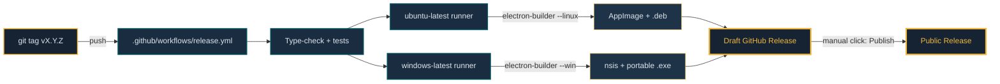

# Releasing

This project uses a **tag → CI → draft release** flow via GitHub Actions. Push a version tag, and the pipeline builds natively on both platforms in parallel, uploads the artifacts to a draft GitHub Release, and waits for you to click Publish.

## The pipeline



The manual Publish click is intentional — a safety net so a broken CI build can never silently ship.

## What runs in CI

- [`.github/workflows/ci.yml`](../.github/workflows/ci.yml) runs on every push and PR: `npm install`, `npm run type-check`, `npm test`.
- [`.github/workflows/release.yml`](../.github/workflows/release.yml) runs on a `v*` tag push (or manual `workflow_dispatch`). It runs the same type-check + tests as a gate, compiles TypeScript, then runs `electron-builder` on each OS in the matrix. Artifacts land in a draft release.

## Cutting a release (requires push access)

```bash
# 1. Bump the version in package.json (e.g. 0.2.0 → 0.2.1)
#    Then commit:
git add package.json
git commit -m "Bump to v0.2.1"
git push

# 2. Tag and push — this triggers the release workflow
git tag v0.2.1
git push origin v0.2.1

# 3. Watch it at https://github.com/adrenal36/instagram-messenger/actions
# 4. Review the draft at https://github.com/adrenal36/instagram-messenger/releases
# 5. Click "Publish release"
```

## Local builds

```bash
npm run dist:linux   # AppImage + .deb → dist/
npm run dist:win     # Windows zip → dist/ (native .exe requires Wine)
```

**Windows cross-compile from Linux:** `electron-builder` runs `winCodeSign` (an rcedit step for icon metadata) through Wine. Without Wine, the local `dist:win` build emits a plain `.zip` fallback. The official GitHub Actions release pipeline builds Windows natively on `windows-latest`, so downloads from the Releases page always have properly-embedded icon metadata. For local builds with full metadata, `sudo apt install wine` and switch `win.target` in `package.json` to `["nsis","portable"]`.

## Why unsigned Windows builds

SmartScreen warns on unsigned `.exe` files. A code-signing certificate costs ~$100/year and has to be renewed annually. For a personal wrapper with no commercial use, that's not worth it — so the installer is unsigned. The user can click **More info → Run anyway** once, or audit the source before installing.

## Why the `publish` block uses `releaseType: draft`

Drafts aren't visible to users until explicitly published. This gives us a window to smoke-test the built artifacts (install them locally from the draft URL) before making them public. If something is wrong, we delete the draft and tag a patch version instead of leaving a broken release in the wild.
